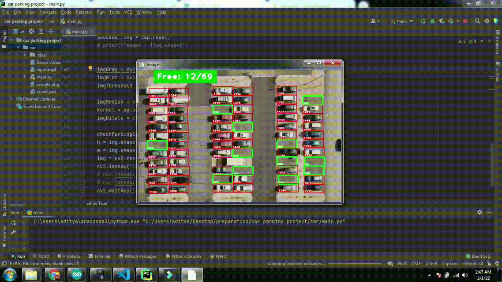

# Car Parking Solution

## Overview
This project is a computer vision-based solution for car parking management that does not rely on deep neural networks. Instead, it utilizes traditional image processing techniques to detect available parking spaces efficiently.

## Features
- **Lightweight & Efficient**: Uses classical computer vision techniques, avoiding the computational cost of deep learning models.
- **Real-time Detection**: Identifies vacant and occupied parking spots in real-time.
- **Easy to Implement**: Can be deployed on various hardware configurations without requiring powerful GPUs.
- **Scalability**: Works well with different parking lot layouts.
